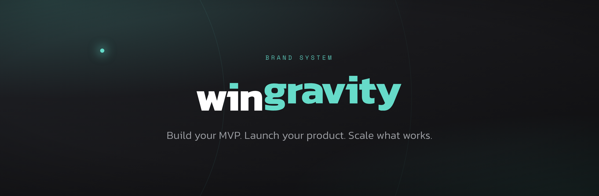
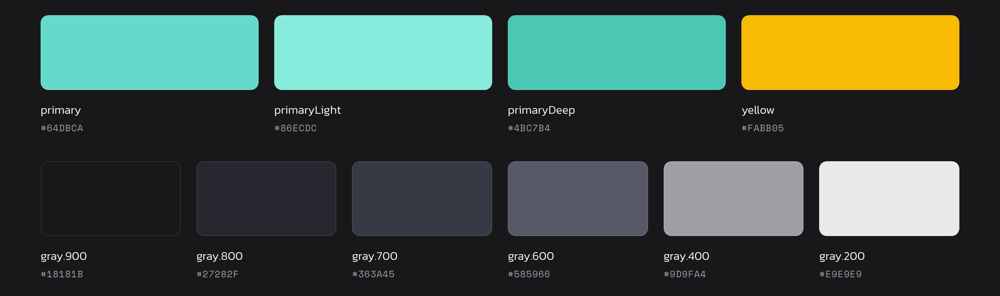
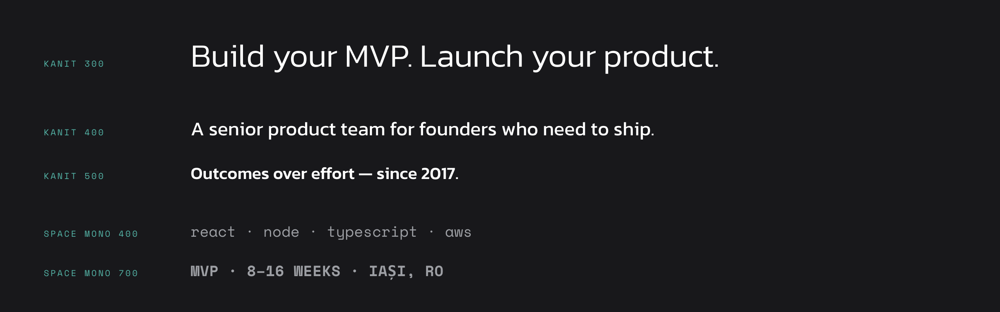

 

**Wingravity brand system.** Tokens, logo, and the generators that use them.

<a href="https://wingravity.com">Website</a> &nbsp;·&nbsp;
<a href="https://docs.wingravity.com">Handbook</a> &nbsp;·&nbsp;
<a href="#aesthetic">Aesthetic</a> &nbsp;·&nbsp;
<a href="#colour">Colour</a> &nbsp;·&nbsp;
<a href="#type">Type</a> &nbsp;·&nbsp;
<a href="#contents">Contents</a> &nbsp;·&nbsp;
<a href="#voice">Voice</a>

 

---

## Aesthetic

Dark, technical, one accent colour.

| | |
| :--- | :--- |
| **Ground** | Charcoal `#18181b` to `#27282f`. Not black. |
| **Accent** | Teal, sparingly. Never a large fill. |
| **Type** | Kanit 300 for body. Emphasis by hierarchy, not weight. |
| **Motifs** | Orbits and horizons, kept subtle. Atmosphere, not clip art. |
| **Imagery** | Real product screenshots over abstract art. |

Not: startup gradients, neon-on-black, enterprise blue, stock photography,
clip-art rockets.

 

---

## Colour

Tokens in [`brand/tokens.json`](brand/tokens.json). Full table and contrast
matrix in [`brand/README.md`](brand/README.md).

> [!WARNING]
> Teal on white is **1.68:1** and fails contrast. It is a dark-surface colour.
> On light grounds use `gray.900` for text.

 

## Type

| Family | Weights | Use |
| :--- | :--- | :--- |
| **Kanit** | 300, 400, 500 | Headings and body. 300 is the default. |
| **Space Mono** | 400, 700 | Code, labels, metadata. Not a body face. |

No Kanit above 500. Both are vendored in [`brand/fonts/`](brand/fonts/) and
self-hosted in production. Do not hotlink Google Fonts.

 

---

## Contents

| | |
| :--- | :--- |
| [`brand/`](brand/) | Tokens, logo, typefaces. Source of truth. |
| [`virtual-backgrounds/`](virtual-backgrounds/) | Backgrounds for Meet, Zoom and Teams. |
| [`lib/`](lib/) | Shared renderer and token loader. |
| [`scripts/`](scripts/) | Repo-level generators, including this page's imagery. |
| [`docs/assets/`](docs/assets/) | Committed documentation imagery. |

Each folder has its own README. No install step; rendering uses the Chrome
already on your machine.

 

---

## Voice

- Outcomes, not effort.
- Numbers over adjectives. 2017. 8 to 16 weeks. 9+ products.
- Name the awkward part: fixed scope, named price, no handoffs to juniors.
- Sentence case in headings and UI.
- "Wingravity" is one word, capital W. Lowercase only inside the wordmark.
- Avoid: revolutionary, cutting-edge, world-class, synergy, unlock, supercharge.

 

---

## Conventions

- Assets are generated from tokens, not exported by hand.
- No hard-coded hex. Tools read `brand/tokens.json`.
- `out/` is gitignored. `docs/assets/` is committed so GitHub can render this page.
- Generators are deterministic. Re-running produces identical bytes.

 

---

## Roadmap

- [ ] `LICENSE` and `TRADEMARK.md`. Code and tokens open, name and logo not.
- [ ] **Standalone mark.** No vector symbol exists, only the wordmark, and the
      app icon is a raster PNG wrapped in an SVG. Every square context (avatars,
      favicons, Slack) is unserved. Biggest gap in the system.
- [ ] Publish `brand/` as a package so the landing site consumes these tokens.
- [ ] Social templates: OG card, square avatar, LinkedIn banner, X header.
- [ ] Document templates: letterhead, invoice, one-pager.
- [ ] Email signature, slide template, illustration and photography direction.
- [ ] Logo misuse examples, shown rather than described.

 

---

Typefaces licensed under the SIL Open Font License. The Wingravity name and logo
are trademarks, not covered by any code license in this repository.

