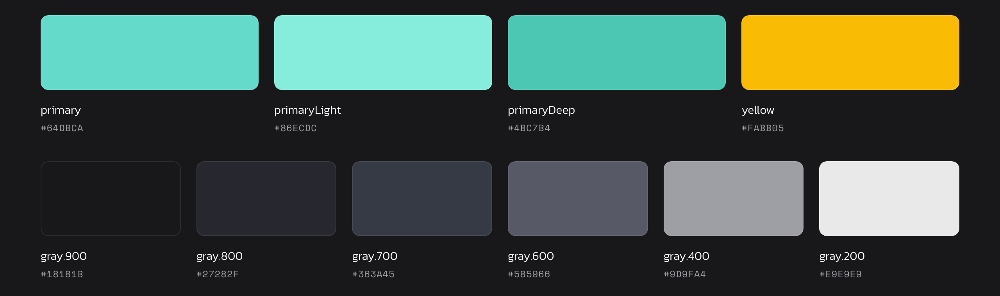
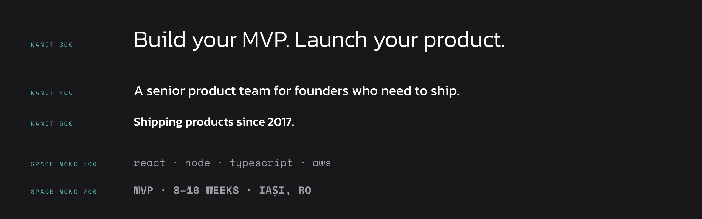

<div align="center">

<br>

<picture>
  <source media="(prefers-color-scheme: dark)" srcset="packages/brand/logo/wordmark-on-dark.svg">
  
</picture>

<br><br>

**Brand system.** Tokens, logo, and the generators that use them.

<a href="https://wingravity.com">Website</a> &nbsp;·&nbsp;
<a href="https://docs.wingravity.com">Handbook</a> &nbsp;·&nbsp;
<a href="https://wingravity.github.io/branding/">Guidelines</a> &nbsp;·&nbsp;
<a href="#aesthetic">Aesthetic</a> &nbsp;·&nbsp;
<a href="#color">Color</a> &nbsp;·&nbsp;
<a href="#type">Type</a> &nbsp;·&nbsp;
<a href="#contents">Contents</a> &nbsp;·&nbsp;
<a href="#voice">Voice</a>

</div>

<br>

---

## Aesthetic

Dark, technical, one accent color.

| | |
| :--- | :--- |
| **Ground** | Charcoal, `#18181b` to `#27282f`. |
| **Accent** | Teal, sparingly. Never a large fill. |
| **Type** | Kanit 300 for body. Emphasis comes from size and order. |
| **Imagery** | Real product screenshots over abstract art. |
| **Key visual** | The moon, astronaut and laptop collage on the social covers. The one illustration; use it as supplied. |

Avoid: startup gradients, neon-on-black, enterprise blue, stock photography, or
new space clip art beyond the key visual.

<br>

---

## Color



Tokens in [`packages/brand/tokens.json`](packages/brand/tokens.json). Full table
and contrast matrix in [`packages/brand/README.md`](packages/brand/README.md).

> [!WARNING]
> Teal on white is **1.68:1** and fails contrast. `primary` is a dark-surface
> color. On light grounds use `gray.900` for text and `primaryInk` (`#34786f`,
> 5.17:1 on white) for anything teal that has to be read.

<br>

## Type



| Family | Weights | Use |
| :--- | :--- | :--- |
| **Kanit** | 300, 400, 500, 700 | Headings and body. 300 is the default. 700 is display only. |
| **Space Mono** | 400, 700 | Code, labels, metadata. Not a body face. |

Kanit 700 only for a short display line at 40px or larger, such as a banner
headline or a slide title. Never 600, never above 700. Both are vendored in
[`packages/brand/fonts/`](packages/brand/fonts/) and
self-hosted in production. Do not hotlink Google Fonts.

<br>

---

## Contents

An npm workspace. `@wingravity/brand` is the source of truth, and every other
package renders from it.

| Package | What it makes | Run |
| :--- | :--- | :--- |
| [`brand`](packages/brand/) | Tokens, logo, symbol, typefaces. Published as `@wingravity/brand`. | `npm run generate:tokens-css` |
| [`render`](packages/render/) | Shared headless-Chrome renderer. Internal. | |
| [`guidelines`](packages/guidelines/) | The guidelines page ([`docs/index.html`](docs/index.html)) and this page's imagery. | `npm run generate:guidelines` |
| [`virtual-backgrounds`](packages/virtual-backgrounds/) | Backgrounds for Meet, Zoom and Teams, including the key visuals. | `npm run generate:backgrounds` |
| [`social`](packages/social/) | Covers for every account, link preview, posts, Instagram highlights, avatar, icons. | `npm run generate:social-images` |
| [`email-signature`](packages/email-signature/) | Gmail signatures, one per person. | `npm run generate:signatures` |

| | |
| :--- | :--- |
| [`skills/wingravity-brand/`](skills/wingravity-brand/) | Claude skill carrying these rules. Install below. |
| [`docs/`](docs/) | Committed documentation imagery and the guidelines page. |
| [`TRADEMARK.md`](TRADEMARK.md) | What may be done with the name and the mark. |
| [`LICENSE`](LICENSE) | MIT for code and tokens. Excludes the marks and the fonts. |

```
npm install        # links the workspaces; there is nothing to download
npm run generate:all   # every generator
```

Rendering uses the Chrome already on your machine. Each package has its own
README.

### Claude skill

```
ln -s "$PWD/skills/wingravity-brand" ~/.claude/skills/wingravity-brand
```

Claude Code then applies the brand whenever Wingravity material is involved.
Edit the skill here, not the installed copy; the symlink keeps them the same.

<br>

---

## Voice

- Lead with outcomes. Say what the client gets.
- Numbers over adjectives. 2017. 8 to 16 weeks. 9+ products.
- Name the awkward part: fixed scope, named price, no handoffs to juniors.
- Sentence case in headings and UI.
- "Wingravity" is one word, capital W. Lowercase only inside the wordmark.
- Mark the first prominent use in marketing as Wingravity&reg;. It is a
  registered EU trade mark. Rules in [`TRADEMARK.md`](TRADEMARK.md).
- Avoid: revolutionary, cutting-edge, world-class, synergy, unlock, supercharge.

<br>

---

## Conventions

- Assets are generated from the tokens. Nothing is exported by hand.
- No hard-coded hex. Tools read `packages/brand/tokens.json` via `@wingravity/brand`.
- Personal and legal details live in `*.local.json`, which is gitignored. Only
  `*.example.json` is committed.
- Public-facing output is committed, ready to use: each generator writes its
  standard set to `dist/`, and `docs/` holds the guidelines. Nobody needs to run
  a script to get a background, a cover or an icon.
- Not committed: the 2021 source rasters (`packages/social/sources/`),
  personal photos, `*.local.json` and each person's signature. `out/` is for
  ad-hoc renders (other corners, 4K) and is gitignored.
- Generators are deterministic. Re-running produces identical bytes.

<br>

---

<div align="center">
<sub>

Typefaces licensed under the SIL Open Font License. Wingravity&reg; is a
registered trade mark, not covered by any code license in
this repository. See [`TRADEMARK.md`](TRADEMARK.md).

</sub>
</div>
